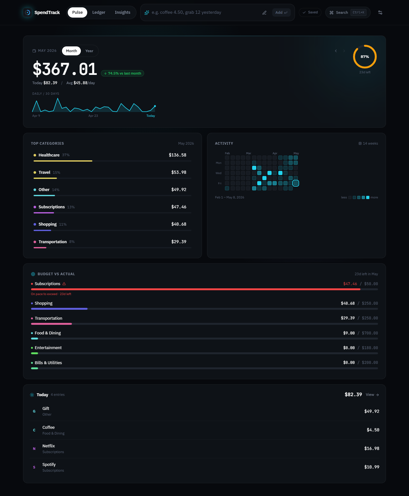

<p align="center">
  
</p>

<h1 align="center">SpendTrack</h1>

<p align="center">
  <strong>Know where your money goes — without the noise.</strong><br/>
  A fast, local-first spending tracker with smart categorisation, real-time budgets, and optional cross-device sync.
</p>

<p align="center">
  
  
  
  
  
  
  
</p>

<p align="center">
  <a href="https://spendtrack-demo.vercel.app"><strong>▶ Try the demo</strong></a>
  &nbsp;·&nbsp;
  <a href="#highlights">Highlights</a>
  &nbsp;·&nbsp;
  <a href="#quick-start">Quick start</a>
  &nbsp;·&nbsp;
  <a href="#architecture">Architecture</a>
  &nbsp;·&nbsp;
  <a href="#cross-device-sync">Sync</a>
</p>

<br/>

<p align="center">
  
</p>

---

## Why SpendTrack

Most personal-finance apps are built around syncing, subscriptions, and dashboards you open once and forget. SpendTrack is built for one thing: **making it effortless to log an expense and instantly see where your money is going.**

- **Offline-first.** Your data lives on your device, in your browser — not on a server. No account, no telemetry, no cloud (until *you* opt in).
- **Friction-free entry.** Type `coffee 4.50 yesterday` and it's in. The smart parser infers item, amount, date, and category from one line.
- **Real-time pacing.** A live month-pace ring tells you whether you're on track without opening a spreadsheet.
- **Optional cross-device sync.** A single UUID code pairs your phone and laptop — no accounts, no passwords, paste once and you're done.
- **Production-grade.** Strict TypeScript, 140 passing tests, sub-100 KB gzipped initial JS, fully PWA-installable.

### Design choices

- **Why offline-first?** Your finances are private. The default should be no servers, no accounts, no tracking. Sync is opt-in and runs against *your own* Supabase project.
- **Why Supabase?** It's free for personal use, the JS SDK is small enough to lazy-load, and Postgres + Realtime gives instant cross-device updates without writing a backend.
- **Why a PWA, not a native app?** Same code on every device, install in one tap, no app-store gatekeepers, full offline support via service worker.

---

## Highlights

| | |
|---|---|
| **Smart entry** | Natural-language parser → category, amount, date inferred from one line |
| **Pulse dashboard** | Month/year totals, daily-pace ring, sparkline trend, category mix, 14-week activity heatmap |
| **Ledger** | Search, filter, edit, undo. Multi-criteria filters live in the URL so views are bookmarkable |
| **Insights** | Recurring-charge detection, 14-day forecast, week-over-week comparisons, anomaly callouts |
| **Budgets** | Per-category monthly caps with side-by-side actual-vs-budget bars |
| **Cross-device sync** | Optional. UUID code pairs devices. Per-expense Last-Write-Wins merge. Tombstone-safe deletes. Realtime push. |
| **PWA** | Installable on iOS & Android. Works fully offline. CSS-keyframe route transitions (no React-state animations that can stall) |
| **Privacy** | No account. No analytics. No tracking. Data is local unless you generate a sync code |

---

## Try it in 30 seconds

| | Where | Notes |
|--|------|-------|
| **▶ Demo** | [spendtrack-demo.vercel.app](https://spendtrack-demo.vercel.app) | Pre-loaded with realistic data — your changes stay on your device |
| **📱 Install** | Open the demo on your phone → Share → **Add to Home Screen** | Behaves exactly like a native app, fully offline |
| **🧹 Make it yours** | Settings → Backup → **Clear all expenses** | Wipes the demo seed; categories and budgets remain |
| **💻 Self-host** | [Quick start ↓](#quick-start) | Clone & run in under a minute — full ownership, zero third-parties |

---

## Screenshots

<table>
<tr>
  <td width="33%" align="center"><b>Pulse</b><br/><sub>Live pace ring · sparkline · heatmap · budgets</sub></td>
  <td width="33%" align="center"><b>Ledger</b><br/><sub>Searchable history · URL-driven filters · undo</sub></td>
  <td width="33%" align="center"><b>Insights</b><br/><sub>Recurring detection · 14-day forecast · trends</sub></td>
</tr>
<tr>
  <td></td>
  <td></td>
  <td></td>
</tr>
</table>

---

## Quick start

**Requirements:** Node.js 20+, npm

```bash
git clone https://github.com/ShadeNKB/spending-budgeting-tracker.git
cd spending-budgeting-tracker
npm install
npm run dev
```

Open [http://localhost:5173](http://localhost:5173). No environment variables needed.

To enable cross-device sync (optional):

```bash
cp .env.example .env.local
# fill VITE_SUPABASE_URL and VITE_SUPABASE_ANON_KEY,
# then run supabase/migrations/001_sync.sql in your Supabase SQL editor.
```

See [`.env.example`](.env.example) for the 3-step setup.

---

## Scripts

```bash
npm run dev        # Local dev server with HMR
npm run build      # Production build
npm run preview    # Preview production build locally
npm run lint       # ESLint
npm run typecheck  # tsc --noEmit (strict)
npm run test:run   # Vitest, single run
```

---

## Architecture

### Local-first by default

On load, the app hydrates from `localStorage`. Every action — adding an expense, changing a budget, renaming a category — writes back immediately. There is no server in the hot path; latency is zero.

```
┌──────────────────────────────────────────────────┐
│  React app (Pulse / Ledger / Insights)           │
│       │                                          │
│       ▼                                          │
│  Zustand stores (expense, sync, ui)              │
│       │                                          │
│       ▼                                          │
│  storage.ts  →  localStorage  (always available) │
│       │                                          │
│       ▼                                          │
│  syncService.ts  ⇆  Supabase (optional relay)    │
└──────────────────────────────────────────────────┘
```

### Cross-device sync (opt-in)

When sync is configured (Supabase env vars + a UUID sync code paired between devices):

- **localStorage is still the source of truth.** Cloud is a stateless relay.
- **Per-expense Last-Write-Wins merge** using `updatedAt ?? createdAt`.
- **Tombstone set** unioned across devices — deletions are permanent everywhere.
- **3 s debounced push** on local changes; **Supabase Realtime subscription** for instant pull on remote changes.
- **Single in-flight Promise lock** prevents push-during-pull races.
- **Exponential backoff** on push failure (1.5 s × 2ⁿ, cap 2 min); resets on success.
- **Realtime auto-reconnect** on `CLOSED / CHANNEL_ERROR / TIMED_OUT`.
- **Payload guard** rejects writes >1 MB (Supabase row limit) with a clear error.
- **No accounts.** The 122-bit UUID is the security boundary.

See [`src/services/syncService.ts`](src/services/syncService.ts) for the merge logic.

### Performance

| | |
|---|---|
| Main bundle (gzip) | **83.7 KB** |
| Total initial download (gzip) | ~190 KB |
| Settings drawer | code-split (lazy) |
| Supabase JS SDK | lazy `import()` — only loaded when sync is configured |
| Hydration | deferred to `useEffect` to keep first paint unblocked |
| Route transitions | CSS keyframe (no React-state animations that can stall) |

### Stability

- Strict TypeScript, no `any`
- 140 passing unit tests across 24 files
- CI smoke test boots `vite preview` and asserts all 4 routes + service worker + manifest
- Storage quota errors are caught and surfaced as a user toast (never silent data loss)
- JSON import: 8 MB file cap, deep schema validation, hostile-data-safe
- Rapid-navigation stress-tested across mobile / desktop / production / 4× CPU-throttled — 290 iterations, 0 blank renders

---

## Cross-device sync

Open Settings → **Sync** on Device 1, hit **Generate sync code**, copy the UUID. On Device 2, paste it. Data merges in <3 seconds. Add an expense on either device — it appears on the other within a second via Realtime.

Architecture in detail: [`docs/USER_GUIDE.md`](docs/USER_GUIDE.md) and [`src/services/syncService.ts`](src/services/syncService.ts).

---

## Tech stack

| Layer | Tools |
|-------|-------|
| Framework | React 19, TypeScript (strict), Vite |
| Styling | Tailwind CSS, CSS custom properties (OLED-near-black theme) |
| State | Zustand + `subscribeWithSelector` |
| Routing | React Router v6 |
| Animation | framer-motion (sparingly — CSS keyframes for route transitions) |
| Search | Fuse.js (smart-entry parser) |
| Dates | date-fns |
| Sync | Supabase Postgres + Realtime (lazy-loaded, opt-in) |
| PWA | vite-plugin-pwa, Workbox |
| Testing | Vitest, Testing Library, Playwright (smoke) |
| Deploy | Vercel |

---

## Project structure

```
src/
  app/          Shell, routing, top/tab bar, sync status pill
  features/     pulse · ledger · insights · entry · settings
  ui/           Reusable primitives (Card, Button, Sheet, Pill, …)
  stores/       Zustand stores (expense, sync, ui)
  services/     storage layer, syncService (Supabase relay)
  lib/          analytics, format, download helpers
  utils/        parseExpense, insights, recurring, helpers
  hooks/        useToast, useHotkeys, useHaptic
public/         favicon, manifest
supabase/       sync migrations
docs/           user guide, screenshots
```

---

## Roadmap & changelog

- ✅ Cross-device sync (Supabase relay, UUID pairing, LWW merge, tombstones)
- ✅ Performance pass — main bundle 83.7 KB gzip (−41% from initial); Supabase + Settings lazy-loaded
- ✅ Rapid-nav blank-render bug eliminated — 290 stress-test iterations, 0 blanks
- ✅ Storage quota toast + JSON import schema validation
- ✅ Production CI smoke test on every route + service worker + manifest

Full history: [`CHANGELOG.md`](CHANGELOG.md).

---

## Contributing

PRs and issues welcome. Please don't share real spending data in public issues or screenshots.

- [User guide](docs/USER_GUIDE.md)
- [Contributing](CONTRIBUTING.md)
- [Security policy](SECURITY.md)

---

## License

[MIT](LICENSE) — built by [ShadeNKB](https://github.com/ShadeNKB)
