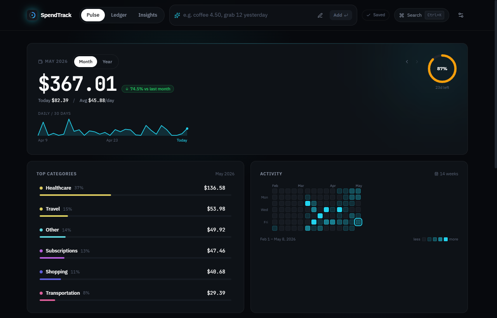
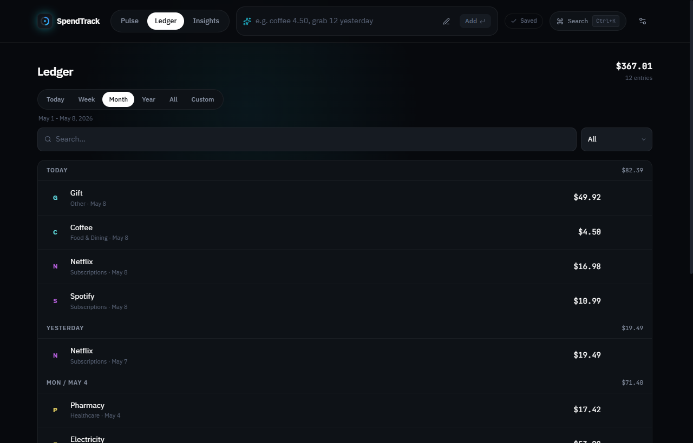
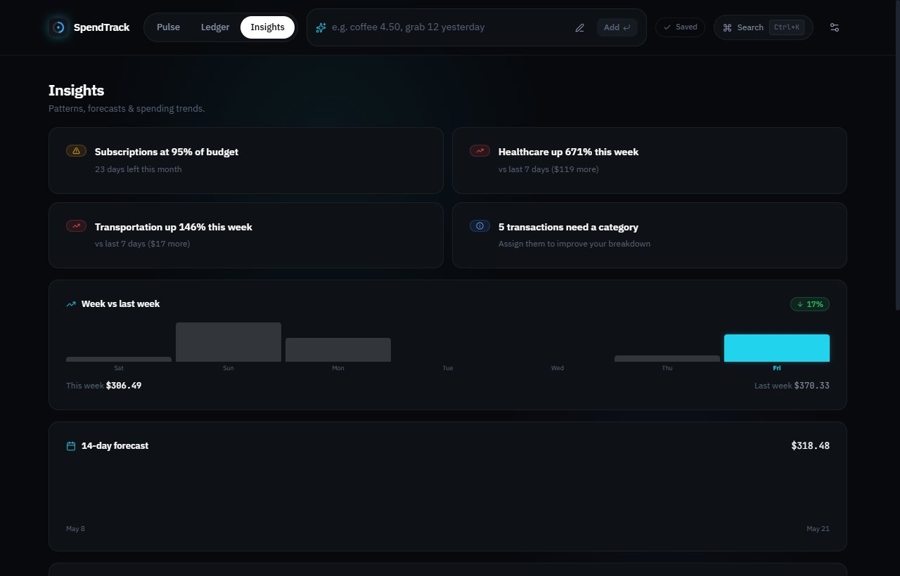

<p align="center">
  
</p>

<h1 align="center">SpendTrack</h1>

<p align="center">
  <strong>Know where your money goes. Without the noise.</strong><br/>
  A fast, local-first expense tracker built for daily use - no account, no sync, no friction.
</p>

<p align="center">
  
  
  
  
  
</p>

**[Quick Start](#quick-start) / [Features](#features) / [How It Works](#how-it-works) / [Stack](#stack)**

<br/>

<p align="center">
  
</p>

<br/>

---

## Why SpendTrack

Most budgeting apps are built around syncing, subscriptions, and dashboards you open once and forget. SpendTrack is built for one thing: making it effortless to log an expense and understand where your money is going.

- **Local-first** - your data never leaves the browser
- **Friction-free entry** - natural language parsing gets out of your way
- **Meaningful feedback** - pace tracking, category breakdowns, and recurring detection surface insights without effort

---

## Features

### Pulse Dashboard

At-a-glance spending visibility: current month total, daily pace, category breakdown, activity heatmap, and recent entries.

### Ledger

Full transaction history with fast search, date/category filters, inline editing, and bulk delete.

### Budget Tracking

Set monthly budgets per category. See planned vs actual side-by-side with progress indicators.

### Insights

Trend analysis, spending forecasts, recurring expense detection, and anomaly signals - automatically surfaced from your history.

### Smart Entry

Type natural inputs like `coffee 4.50 yesterday` or `netflix 15 monthly`. The parser infers category, amount, and date.

### Private & Portable

No backend. No account. Data lives in `localStorage`. Export JSON backups or CSV for spreadsheets anytime.

---

## Screenshots

| Pulse | Ledger | Insights |
|:---:|:---:|:---:|
|  |  |  |
| Dashboard, pace, heatmap | Searchable history | Trends and forecasts |

---

## Quick Start

**Requirements:** Node.js 20+, npm

```bash
git clone https://github.com/ShadeNKB/spending-budgeting-tracker.git
cd spending-budgeting-tracker
npm install
npm run dev
```

Open [http://localhost:5173](http://localhost:5173). No environment variables are needed.

---

## Scripts

```bash
npm run dev        # Local dev server
npm run build      # Production build
npm run preview    # Preview production build locally
npm run lint       # ESLint
npm run typecheck  # TypeScript check
npm run test:run   # Run tests once
```

---

## How It Works

SpendTrack is entirely browser-side. On load, it hydrates from `localStorage`. Every action - adding an expense, updating a budget, changing a category - writes back immediately. No server, no latency, no auth.

Three screens cover the full workflow:

| Screen | Purpose |
|--------|---------|
| **Pulse** | Spending overview: totals, pace, category mix, heatmap |
| **Ledger** | Transaction management: search, filter, edit, delete |
| **Insights** | Pattern analysis: trends, forecasts, recurring detection |

---

## Stack

| Layer | Tools |
|-------|-------|
| Framework | React 19, TypeScript, Vite |
| Styling | Tailwind CSS, CSS custom properties |
| State | Zustand |
| Routing | React Router |
| Animation | Framer Motion |
| Charts | Chart.js, react-chartjs-2 |
| Search | Fuse.js |
| Dates | date-fns |
| Testing | Vitest, Testing Library |

---

## Project Structure

```text
src/
  app/          Shell, routing, navigation, sync status
  features/     Entry, pulse, ledger, insights, settings
  hooks/        Shared React hooks
  lib/          Analytics and formatting helpers
  services/     localStorage layer
  stores/       Zustand stores
  ui/           Reusable UI components
  utils/        Parsing, insights, recurring expense helpers
```

---

## Roadmap

- [x] Real product screenshots in `docs/screenshots/`
- [ ] Deployed demo link
- [ ] Code-split chart-heavy routes
- [ ] Expand test coverage: parsing, analytics, storage, recurring detection
- [ ] Browser smoke tests in CI

---

## Privacy

SpendTrack does not transmit data anywhere. All expenses, budgets, and settings stay in your browser until you choose to export them.

---

## License

[MIT](LICENSE) - built by [ShadeNKB](https://github.com/ShadeNKB)
